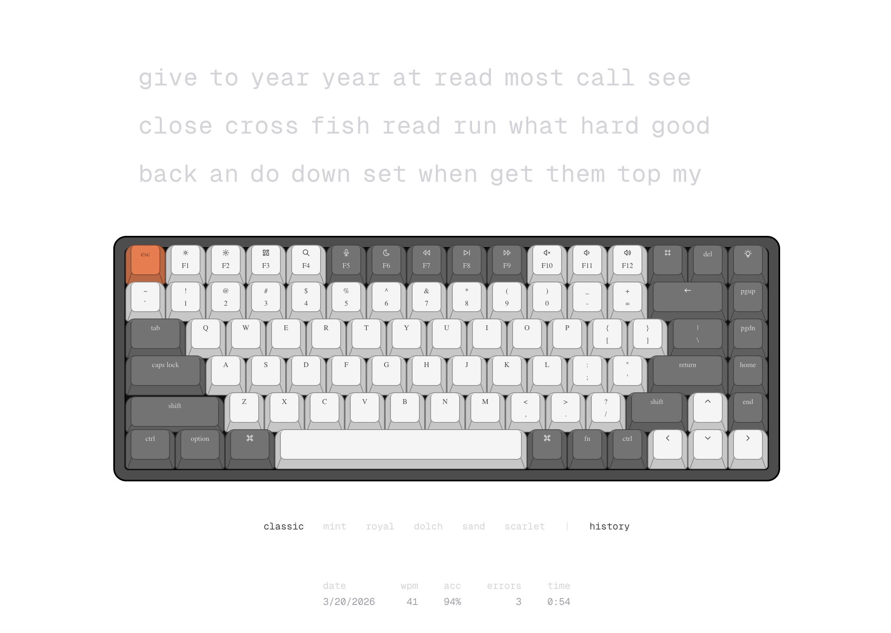

# Mavis Bacon 🥓

A minimal typing test app with a realistic virtual keyboard.



## Features

- **Typing test** — 50 random common English words per round. Type each word and press space to advance. Characters highlight green when correct, red when wrong.
- **Virtual keyboard** — An interactive on-screen keyboard that highlights keys as you type. Supports both physical keyboard input and mouse clicks.
- **Themes** — 6 keyboard themes: classic, mint, royal, dolch, sand, scarlet. Your selection persists across sessions.
- **Results** — After completing a test you see your WPM, accuracy, error count, and elapsed time.
- **History** — All results are saved to localStorage. Toggle the history view to see your last 20 sessions.
- **Sound** — Key press sounds for tactile feedback.

## Getting Started

```bash
npm install
npm run dev
```

Open [http://localhost:3000](http://localhost:3000) to start typing.

## Tech Stack

- Next.js (App Router)
- React with `useReducer` for state management
- Tailwind CSS
- localStorage for persistence
